# VDA5050 Master + Client — Plan

A Python VDA5050 master and a Python VDA5050 client, talking over MQTT.
This document describes the architecture, the modules, and the demo
flow — read this top to bottom to understand the system before touching
code.

Spec source: `.claude/skills/vda5050/VDA5050-V2.1.0-2025-01-1-4.pdf`.
Terminology glossary (which words below are VDA5050 spec terms vs. our
own naming): `.claude/skills/vda5050/vda5050-terminologies.md`.
Sequence diagrams referenced throughout live in `diagrams/` as standalone
PlantUML files with rendered PNGs next to each.

---

## 1. Architecture

- **Transport**: MQTT only (`paho-mqtt`). No ROS, no DDS, no message
  codegen — just the AGV's wire protocol.
- **Client style**: a synchronous `paho-mqtt` client (`loop_start()`
  background thread + plain callbacks). One connection, a handful of
  callbacks, a timer for the heartbeat.
- **Models**: pydantic v2 models, with field names that are the
  spec's own camelCase names, verbatim (`orderId`, `nodeId`,
  `actionType`, …). What's in the code, what's in the JSON on the wire,
  and what's in the spec PDF are always the same string.
- **Optional fields**: plain `Optional[X] = None`.
- **QoS per topic**: `order`=0, `instantActions`=0, `state`=0,
  `factsheet`=0, `visualization`=0, `connection`=1 (full topic table in
  §7).
- **Module naming**: one module per VDA5050 topic wherever that's the
  module's whole job (`orders.py`, `state.py`); a small number of
  generic names (`fleet.py`, `master.py`, `vehicle.py`, `mqtt.py`,
  `main.py`) are used for the handful of responsibilities that have no
  spec equivalent — see §6.

---

## 2. Scope

**In scope:** one master process, one simulated AGV client process,
local Mosquitto broker. Full `order` (base + horizon + order-update/
stitching — V2, see §11), `instantActions` (`cancelOrder` first;
`stateRequest`/`startPause`/`stopPause` later), full `state` message,
`connection` (last-will + graceful ONLINE/OFFLINE, retained), minimal
`factsheet` stub (retained, answers `factsheetRequest`). Predefined
actions: `pick`, `drop`, `startPause`/`stopPause`, `cancelOrder`. Full
`actionStatus` lifecycle (`WAITING→INITIALIZING→RUNNING→PAUSED→
FINISHED/FAILED`) and `blockingType` (`NONE`/`SOFT`/`HARD`) handling,
since that's shared protocol logic, not vehicle-specific (V0 simplifies
`SOFT`/`HARD` to both just mean "block driving"; the full distinction is
a V2 item).

**Out of scope (defer):** `visualization` topic, maps
(`downloadMap`/`enableMap`/`deleteMap`), `corridor`, `trajectory` (NURBS),
multi-AGV traffic/deadlock handling, `zoneSetId`, full `factsheet`
detail, real motor/localization integration, multiple AGVs (design so
adding a second AGV is just "another entry in the master's `Fleet`," but
don't build fleet-traffic logic yet).

---

## 3. Shared vocabulary — `vda5050_common/`

```
vda5050_common/
  __init__.py
  models.py    # every message + nested object, camelCase fields
  topics.py    # topic-string builder
  mqtt.py      # thin MQTT connection wrapper (no VDA5050 semantics)
  time.py      # timestamp / headerId helpers
```

**`models.py`** — pydantic v2 `BaseModel` subclasses, one per spec object
name (`Order`, `Node`, `NodePosition`, `Edge`, `Action`,
`ActionParameter`, `InstantActions`, `State`, `NodeState`, `EdgeState`,
`ActionState`, `BatteryState`, `Error`, `ErrorReference`, `Info`,
`InfoReference`, `SafetyState`, `Connection`, `Factsheet`, plus the
header fields inlined into every top-level message as
`headerId`/`timestamp`/`version`/`manufacturer`/`serialNumber`). Field
names are the camelCase spec names — no translation. `Factsheet` is a
minimal stub for MVP (header + a hardcoded `typeSpecification`); full
detail is a later phase. This is the only place these shapes are
defined — both `vda5050_master` and `vda5050_client` import from here,
neither defines its own copy.

**`topics.py`** — `topic(interface, major_version, manufacturer, serial,
name) -> str`, builds `interfaceName/vN/manufacturer/serialNumber/topic`
per spec §6.3, e.g. `uagv/v2/KIT/0001/order`. `QOS = {"order": 0,
"instantActions": 0, "state": 0, "factsheet": 0, "visualization": 0,
"connection": 1}`, looked up, never hardcoded per publish call.

**`mqtt.py`** — thin wrapper around `paho.mqtt.client.Client`: connect,
configure last-will, `publish(topic_name, model, retain=False)` (looks up
QoS via `topics.QOS`, calls `model.model_dump_json(exclude_none=True)`),
`subscribe(topic_name, callback)`. No VDA5050 semantics live here —
purely transport, shared by both `vda5050_master/mqtt.py` and
`vda5050_client/mqtt.py` (which each own *their own* connection instance
using this wrapper).

**`time.py`** — `next_header_id()` per-topic counter helper,
`now_iso8601()` timestamp helper.

---

## 4. Master modules — `vda5050_master/`

| Module | Responsibility | Owns the MQTT connection? | Maps to |
|---|---|---|---|
| `fleet.py` | Tracks all known AGVs. `Agv` (one per AGV: `manufacturer`, `serialNumber`, `latestState`, `latestConnection`, `latestFactsheet`, `currentOrderId`, `currentOrderUpdateId`). `Fleet.get_or_create(manufacturer, serialNumber)`, `.record_state(agv, state)`, `.record_connection(agv, connection)`, `.record_factsheet(agv, factsheet)`, `.clear_current_order(agv)`, `.mark_unreachable(agv)`. `Agv` is the same role as rmf2_device_manager's per-AGV "MobileRobotDevice" proxy — see §13. | No | spec noun **AGV** + the `Connection`/`Factsheet`/`State` it stores. `Fleet`/`mark_unreachable`/`clear_current_order` are invented — the spec never describes how a master tracks multiple AGVs internally. |
| `orders.py` | Pure construction of outbound messages — **no sending, no decisions**. `build_order(agv, waypoints) -> Order`, `build_order_update(agv, new_waypoints) -> Order` (orderId/orderUpdateId increment, `sequenceId` assignment, base/horizon split, stitching-node rule), `build_instant_actions(agv, action_type, params=None) -> InstantActions`. | No | `Order`, `Node`, `Edge`, `sequenceId`, `InstantActions`, `Action`. Function names are invented. |
| `master.py` | The decision brain. `assign_order(agv_id, waypoints) -> (assignment_id, AssignmentDecision)`, `cancel_order(agv)`, `on_state(agv, state)` (checks completion → `newBaseRequest` → error → else record progress, in that order; also derives each AGV's `OrderPhase`), `on_connection(agv, connection)`, `on_factsheet(agv, factsheet)`. Also tracks the master's own `MasterConnectionState` (its MQTT-connectivity health, not any AGV's). Calls into `fleet.py` (read/update records), `orders.py` (build messages), and `mqtt.py`'s publish functions (send them) — but never touches the socket itself. `AssignmentDecision`/`OrderPhase`/`MasterConnectionState` are borrowed from rmf2_device_manager's VDA5050 Master Device Controller design — see §13. | No (calls `mqtt.py`'s `publish_order`/`publish_instant_actions`, doesn't manage the connection) | `State`, `Connection`, `Factsheet`, `newBaseRequest`. All function names invented — the spec has no concept of a "decision brain," only the messages it reacts to. |
| `mqtt.py` | **Only** module that owns the MQTT connection. Subscribes to `state`/`connection`/`factsheet`; parses incoming JSON into pydantic models; forwards to `fleet.py` (always) and `master.py` (for `on_state`/`on_connection`/`on_factsheet`); exposes `publish_order(agv, order)` / `publish_instant_actions(agv, actions)` for `master.py` to call. | **Yes** | no spec equivalent — pure transport |
| `main.py` | Creates `Fleet`, `Master`, the MQTT adapter; starts the MQTT loop; provides a demo CLI / hardcoded order. | No (delegates to `mqtt.py`) | no spec equivalent |

```
vda5050_master/
  __init__.py
  fleet.py
  orders.py
  master.py
  mqtt.py
  main.py
```

---

## 5. Client modules — `vda5050_client/`

| Module | Responsibility | Owns the MQTT connection? | Maps to |
|---|---|---|---|
| `orders.py` | AGV-side order handling. Tracks `orderId`, `orderUpdateId`, `nodeStates`, `edgeStates`, `lastNodeId`, `lastNodeSequenceId`. `accept_or_reject(order)` (V0: simplified subset of the spec's Figure 8 tree — reject if already busy with an incompatible order, wrong `orderUpdateId`, invalid node/edge sequence, or first node unreachable; full Figure 8 nuance is a V2 item, see §11), `apply_order(order)`, `mark_node_reached(node_id)`, `cancel_order()` (Figure 9), `is_order_complete()`, `next_node()`. | No | topic **`order`** — `Order`, `Node`, `Edge`, `NodeState`, `EdgeState`. Function names invented. |
| `actions.py` | Runs `Action`s. `start_action(action)`, `tick_actions()`, `is_driving_blocked()`, `fail_all_running()`. Lifecycle `WAITING→INITIALIZING→RUNNING→FINISHED/FAILED` (spec §6.11). V0 simplification: `SOFT` and `HARD` both just block driving (`NONE` doesn't); the spec's full parallel-execution-list nuance for multiple simultaneous actions (Figure 17) is a V2 item. | No | spec sections **"Actions" / "Action states"** — `Action`, `ActionState`, `ActionStatus`, `BlockingType`. Function names invented. |
| `vehicle.py` | The simulated robot — **deliberately not spec-named**, since the spec defines the AGV's interface, never its internals/kinematics. The one module a real robot driver replaces. `tick()`, `move_towards_next_node()`, `check_node_reached()` → calls `orders.mark_node_reached(...)`, starts node actions via `actions.py`, respects `actions.is_driving_blocked()`. V0: simple 2D movement is enough. | No | `NodePosition`, `allowedDeviationXY`/`allowedDeviationTheta` (no module-level spec equivalent) |
| `state.py` | Builds `State` messages. `mark_dirty(reason)`, `build_state()`, `should_publish()`, `clear_dirty()`. Includes `orderId`/`orderUpdateId`/`lastNodeId`/`lastNodeSequenceId`/`nodeStates`/`edgeStates`/`actionStates`/`batteryState`/`agvPosition`/`errors`/`newBaseRequest`. V0: publish every 1s or whenever dirty (the spec's real 30s heartbeat default is a V1 item, see §11). | No | topic **`state`** — `State` and its nested objects. Function names invented. |
| `mqtt.py` | **Only** module that owns the MQTT connection. Connects; publishes `connection=ONLINE`; publishes `connection=OFFLINE` on graceful shutdown; configures last-will `connection=CONNECTIONBROKEN`; publishes retained `factsheet`; subscribes to `order`/`instantActions`; publishes `state`/`factsheet`/`connection`. Forwards incoming messages into `orders.py`/`actions.py`. No domain logic. | **Yes** | topics **`connection`**, **`factsheet`** (logic for these two is thin enough to live here rather than in their own files — revisit if that changes) |
| `main.py` | Creates the order state, action runner, simulated vehicle, state builder, MQTT adapter; runs the simulation tick loop (every 100ms: `actions.tick()` → `vehicle.tick()` → `state.publish_if_dirty_or_heartbeat()`). | No (delegates to `mqtt.py`) | no spec equivalent |

```
vda5050_client/
  __init__.py
  orders.py
  actions.py
  vehicle.py
  state.py
  mqtt.py
  main.py
```

**Spec-term-vs-invented check** (per `vda5050-terminologies.md` rules):
file names map to topics where the content genuinely warrants a
dedicated file (`orders.py`↔`order`, `actions.py`↔Actions/Action states,
`state.py`↔`state`); `connection`/`factsheet` are thin enough to share
`mqtt.py` at this size. `fleet.py`, `master.py`, `vehicle.py`, `mqtt.py`,
`main.py` have no spec equivalent and are flagged as such — none of
those five names, nor any function name in either package, appears in
the PDF. `vda5050-terminologies.md` §8 tracks this exact module list.

---

## 6. Why the modules are split this way

- **`orders.py` builds messages, `master.py` decides when to send
  them.** `orders.py` is a pure function: give it waypoints, get back an
  `Order`. No AGV-state branching beyond what `sequenceId`/stitching
  require — trivial to test, never needs a mock AGV record. `master.py`
  is where the actual business rules live: when an order counts as
  complete, when to ask for a horizon extension, when to escalate an
  error. That's the part of the system that grows as the fleet model
  grows (multi-AGV traffic, charging routing, retries) — it deserves to
  be its own file.
- **Client `connection`/`factsheet` handling lives inside `mqtt.py`**
  rather than in their own files. That logic is a few lines each (arm
  last-will, publish `ONLINE`/`OFFLINE`/retained `factsheet`) with no
  decisions in it — one file is simpler and loses nothing. Split it out
  later if it grows.
- **Master folds `InstantActions` construction into `orders.py`**
  (master only ever *constructs* `Order` and `InstantActions` to send —
  both are "outbound message building" from master's point of view).
  Client keeps a dedicated `actions.py`, because client-side action
  *handling* (the `actionStatus` state machine, `blockingType` queueing)
  is real, non-trivial, growing logic — not just message construction.
- **Testability**: `pytest` against `fleet.py`/`orders.py`/`master.py`
  (master) or `orders.py`/`actions.py`/`vehicle.py` (client) directly,
  zero MQTT import — `mqtt.py` is the only file in each package that
  touches `paho-mqtt`.
- **One axis of change per module**: a new predefined action touches
  `actions.py` (client) and maybe `orders.py` (master, if master needs to
  build it). A new master decision (e.g. "route to charger below X%")
  touches only `master.py`. Swapping the simulator for a real robot
  touches only `vehicle.py`.
- **Not over-split**: 5 modules in master, 6 in client. No
  `*Factory`/`*Repository`/`*Gateway`/`*Strategy`/`*Manager` anywhere.

---

## 7. MQTT topic / QoS map

| Topic | Pub | Sub | QoS | Retained |
|---|---|---|---|---|
| `order` | master | client | 0 | no |
| `instantActions` | master | client | 0 | no |
| `state` | client | master | 0 | no |
| `connection` | client | master | 1 | **yes** |
| `factsheet` | client | master | 0 | **yes** |
| `visualization` | — | — | (not built) | — |

Suggested topic shape (spec §6.3): `interfaceName/vN/manufacturer/
serialNumber/topic`, e.g. `uagv/v2/KIT/0001/order`.

---

## 8. The demo flow (build this first, everything else is optional until it works)

```txt
Client comes online
→ Master sees AGV
→ Master sends Order
→ Client accepts Order
→ Client moves through Nodes and Edges
→ Client publishes State
→ Master sees Order completed
```

---

## 9. Scenario catalog — one sequence diagram per behavior

Each scenario's diagram is a standalone PlantUML file under `diagrams/`,
with a rendered PNG next to it (regenerate via `java -jar
.tools/plantuml.jar "diagrams/*.plantuml"` after editing any of them).

### 9.1 Client startup / connected

AGV announces itself; master registers it.
Diagram: `diagrams/01_client_startup.plantuml`

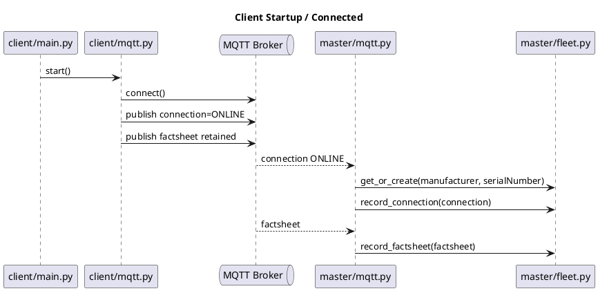

Events: `ClientStarted`, `MqttConnected`, `ConnectionPublishedOnline`,
`FactsheetPublished`, `MasterReceivedConnection`,
`MasterReceivedFactsheet`, `AgvRegistered`.

### 9.2 Client disconnects (unexpected) / graceful shutdown

Master detects an AGV disappearing unexpectedly, vs. a clean shutdown.
Diagrams: `diagrams/02_client_disconnect_unexpected.plantuml`,
`diagrams/03_client_shutdown_graceful.plantuml`

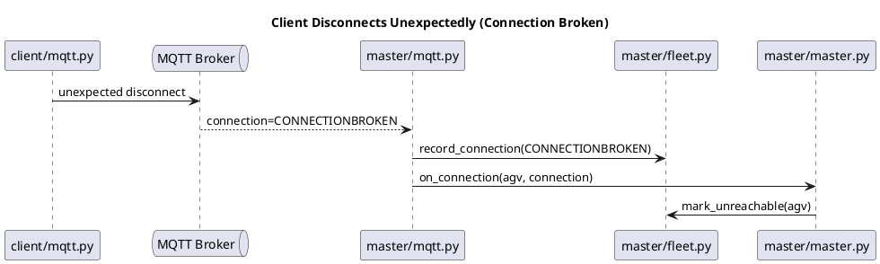
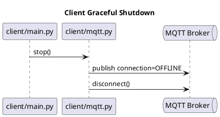

Events: `ClientDisconnectedUnexpectedly`, `ConnectionBrokenReceived`,
`AgvMarkedUnreachable`, `ClientStopping`, `ConnectionPublishedOffline`,
`MqttDisconnected`.

### 9.3 Master assigns a new order

Diagram: `diagrams/04_master_assigns_order.plantuml`

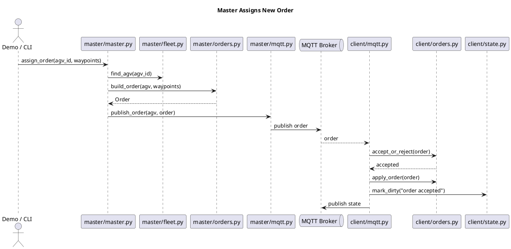

Events: `OrderRequested`, `OrderBuilt`, `OrderPublished`,
`OrderReceived`, `OrderAccepted`, `OrderApplied`, `StateDirty`,
`StatePublished`.

### 9.4 Client rejects an order

Diagram: `diagrams/05_client_rejects_order.plantuml`

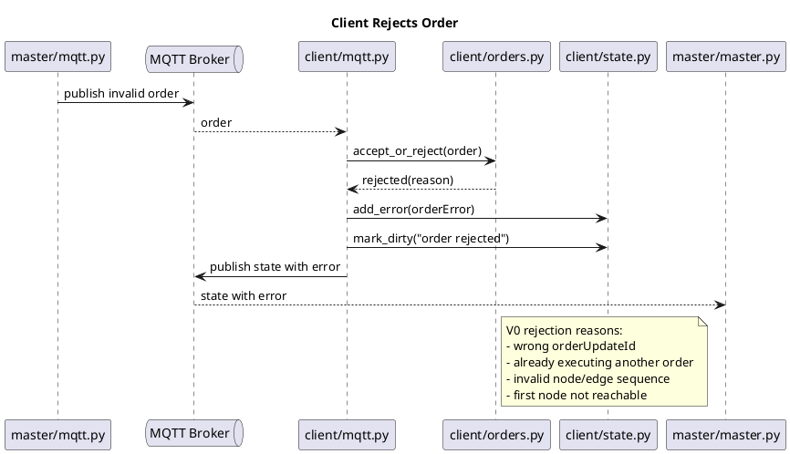

V0 rejection reasons (deliberately a subset of the spec's full Figure 8
tree — see §11 V2 for the rest): wrong `orderUpdateId`; client already
executing another order; invalid node/edge sequence; first node not
reachable from current position.

Events: `OrderReceived`, `OrderRejected`, `OrderErrorAdded`,
`StatePublishedWithError`, `MasterReceivedOrderError`.

### 9.5 Client moves through nodes and edges

Diagram: `diagrams/06_node_edge_traversal.plantuml`

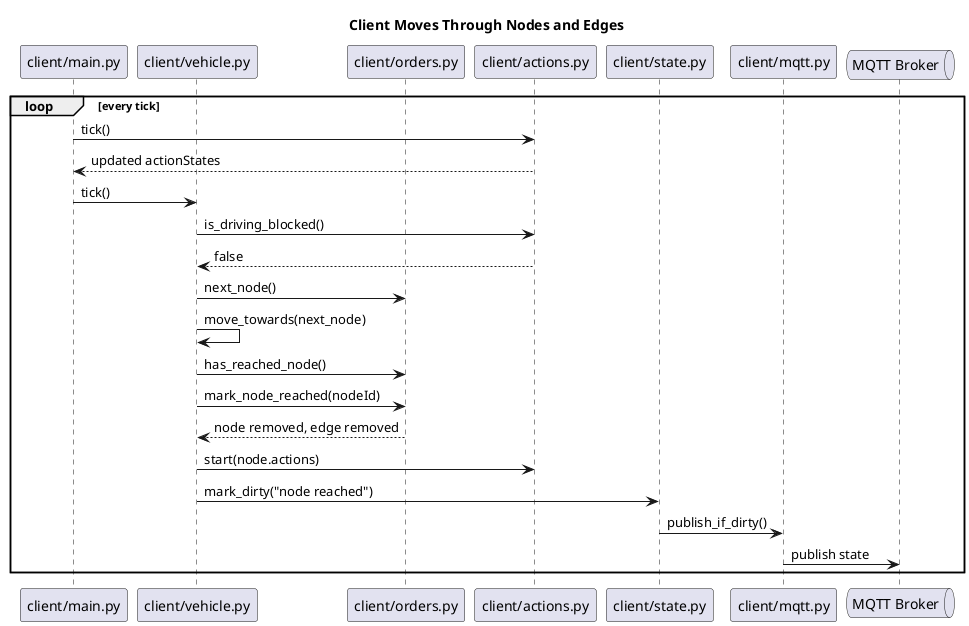

Events: `SimulationTick`, `ActionTicked`, `VehicleTicked`,
`DrivingAllowed`, `MovedTowardsNode`, `NodeReached`, `NodeStateRemoved`,
`EdgeStateRemoved`, `NodeActionsStarted`, `StatePublished`.

### 9.6 Action blocks driving

Diagram: `diagrams/07_action_blocks_driving.plantuml`

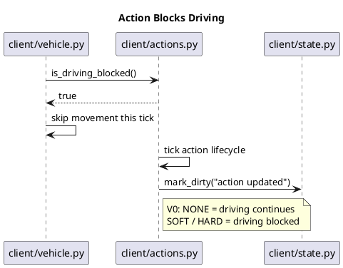

V0: `NONE` = driving continues, `SOFT`/`HARD` both = driving blocked (the
spec's distinction between them — `HARD` also blocking other *actions*,
not just driving — is a V2 item).

Events: `ActionStarted`, `ActionStatusChanged`, `DrivingBlocked`,
`DrivingResumed`, `ActionFinished`.

### 9.7 Order completed

Diagram: `diagrams/08_order_completed.plantuml`

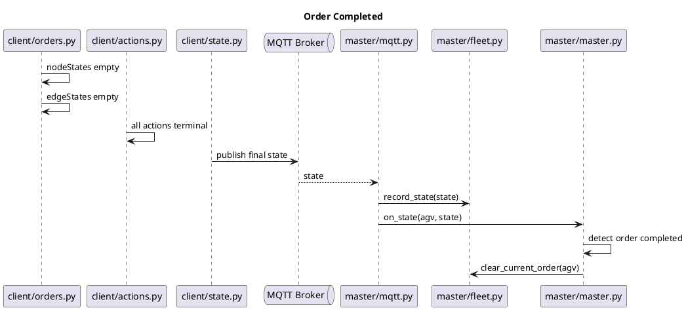

Completion rule:
```python
is_complete = (
    not state.nodeStates
    and not state.edgeStates
    and all(a.actionStatus in {"FINISHED", "FAILED"} for a in state.actionStates)
)
```

Events: `OrderProgressUpdated`, `AllNodesTraversed`, `AllEdgesTraversed`,
`AllActionsTerminal`, `OrderCompleted`, `MasterDetectedOrderCompleted`,
`CurrentOrderCleared`.

### 9.8 Master receives a normal state update

Diagram: `diagrams/09_master_receives_state_update.plantuml`

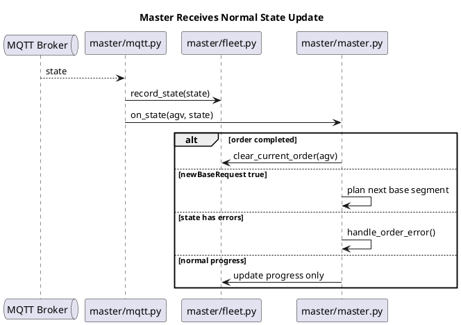

This is `master.py`'s central method:
```python
def on_state(agv, state):
    if is_current_order_completed(agv, state):
        handle_order_completed(agv, state)
        return
    if state.newBaseRequest:
        handle_new_base_request(agv, state)
        return
    if has_current_order_error(agv, state):
        handle_order_error(agv, state)
        return
    record_progress(agv, state)
```

Events: `StateReceived`, `FleetStateUpdated`, `OrderCompletionChecked`,
`NewBaseRequestChecked`, `ErrorsChecked`, `ProgressRecorded`.

### 9.9 Master handles `newBaseRequest` (V1/V2, not V0)

Diagram: `diagrams/10_master_handles_new_base_request.plantuml`

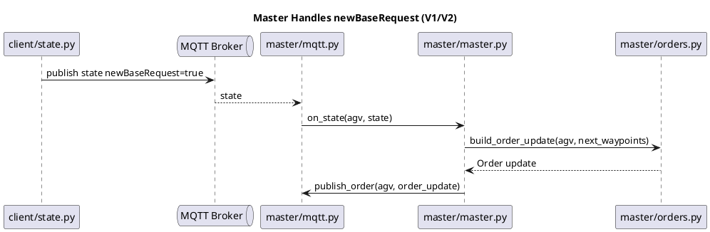

V0 stub:
```python
def handle_new_base_request(agv, state):
    logger.info("newBaseRequest received, but order update is not implemented yet")
```

Events: `NewBaseRequestReceived`, `NextBaseSegmentPlanned`,
`OrderUpdateBuilt`, `OrderUpdatePublished`.

### 9.10 Master sends `cancelOrder`

Diagram: `diagrams/11_master_sends_cancel_order.plantuml`

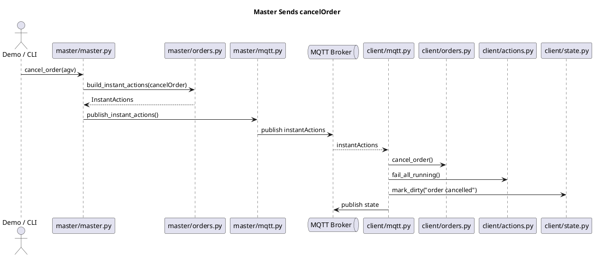

First (and for V0/V1, only) `instantAction` implemented: `cancelOrder`.
`startPause`/`stopPause`/`initPosition` etc. wait for V2+.

Events: `CancelRequested`, `InstantActionsBuilt`,
`InstantActionsPublished`, `InstantActionsReceived`,
`CancelOrderApplied`, `RunningActionsFailed`, `StatePublished`.

### 9.11 Order update / stitching node (V2 — do later)

Diagram: `diagrams/12_order_update_stitching.plantuml`

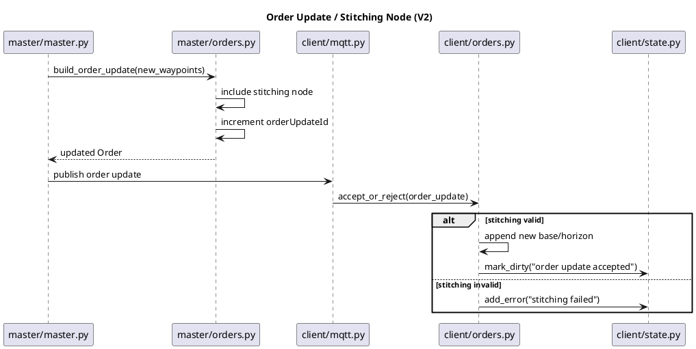

V0/V1 avoid this entirely by sending small, complete orders instead.

Events: `OrderUpdateRequested`, `StitchingNodeSelected`,
`OrderUpdateIdIncremented`, `OrderUpdatePublished`,
`OrderUpdateReceived`, `StitchingValidated`, `OrderUpdateAccepted`,
`OrderUpdateRejected`.

### 9.12 State heartbeat

Diagram: `diagrams/13_state_heartbeat.plantuml`

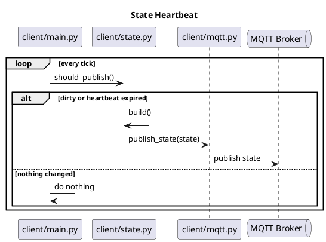

V0: 1s heartbeat for easy debugging. V1+: spec's real 30s default.

Events: `StateDirty`, `HeartbeatExpired`, `StateBuilt`, `StatePublished`,
`DirtyCleared`.

---

## 10. Event / logging convention

No event bus. Just structured logging — this is intentional, not a
placeholder for "build one later":

```python
logger.info("event=order.accepted order_id=%s", order.orderId)
```

```python
class EventName(str, Enum):
    CLIENT_STARTED = "client.started"
    MQTT_CONNECTED = "mqtt.connected"
    CONNECTION_PUBLISHED = "connection.published"
    FACTSHEET_PUBLISHED = "factsheet.published"

    ORDER_REQUESTED = "order.requested"
    ORDER_BUILT = "order.built"
    ORDER_PUBLISHED = "order.published"
    ORDER_RECEIVED = "order.received"
    ORDER_ACCEPTED = "order.accepted"
    ORDER_REJECTED = "order.rejected"
    ORDER_APPLIED = "order.applied"

    VEHICLE_TICKED = "vehicle.ticked"
    NODE_REACHED = "node.reached"

    ACTION_STARTED = "action.started"
    ACTION_FINISHED = "action.finished"

    STATE_DIRTY = "state.dirty"
    STATE_PUBLISHED = "state.published"
    STATE_RECEIVED = "state.received"

    ORDER_COMPLETED = "order.completed"
    CONNECTION_BROKEN = "connection.broken"

    CANCEL_REQUESTED = "cancel.requested"
    CANCEL_APPLIED = "cancel.applied"
```

> All names in this enum (and every "Events:" list in §9) are our own
> logging vocabulary, not VDA5050 terms — see `vda5050-terminologies.md`
> for the closed list of what actually is.

---

## 11. Implementation priority

**V0 — core happy path.** Implement only these first:
1. Client startup / `ONLINE` / factsheet (§9.1)
2. Master sees the AGV
3. Master assigns a new order (§9.3)
4. Client accepts the order
5. Client moves through nodes and edges (§9.5)
6. Client publishes state
7. Master detects order completed (§9.7, §9.8)

**V1 — reliability and basic control.** Add:
1. Client rejects an invalid order (§9.4)
2. Client disconnect / `CONNECTIONBROKEN` (§9.2)
3. Master sends `cancelOrder` (§9.10)
4. Action blocking (§9.6)
5. Heartbeat state publish (§9.12)

**V2 — full spec correctness.** Add:
1. Order update / stitching node (§9.11)
2. `newBaseRequest` handling (§9.9)
3. Full base/horizon split nuance
4. Full Figure 8 order-acceptance tree (beyond the V0 subset in §9.4)
5. Full Figure 17 blocking-type parallel-execution-list behavior
6. Better error handling

---

## 12. Stack

Python 3.11+, `pydantic` v2, `paho-mqtt` (sync client + background
thread), `pytest`. Local broker: Eclipse Mosquitto via
`docker-compose.yml` (single service, default config, port 1883). No
database — both processes are in-memory for the MVP.

---

## 13. Correspondence to rmf2_device_manager's VDA5050 Master Device Controller

`rmf2_device_manager/docs/brainstorm/vda5050/` (a sibling project in this
repo) is designing a ROS2-based **VDA5050 Master Device Controller**
("MDC") that sits between a higher-level orchestrator (RES/DM) and real
AGVs. This MVP plays a smaller, ROS-free subset of that same role — no
RES/DM layer, no ROS2 — but the master/AGV-tracking shapes below are
borrowed deliberately so a future port is closer to a rename than a
redesign. Local copies of the relevant reference files live in
`references/` in this repo (see §14) so this project doesn't depend on
the sibling repo being checked out alongside it.

| Our piece | rmf2_device_manager equivalent | Local reference copy |
|---|---|---|
| `vda5050_master` package | the MDC itself, minus the RES/DM-facing ROS topics | `references/vda5050MasterDeviceController/` |
| `fleet.py`'s `Agv` | the MDC's internal per-AGV "MobileRobotDevice" proxy | `references/vda5050ClientMobileRobotDevice/` |
| `vda5050_client` package | the real/simulated AGV the MDC talks to over MQTT (not modeled as a separate component in their docs — it's just "the AGV" in their sequence diagram) | — |
| `master.assign_order()`'s return value | `AssignmentResult` | `references/messages/msg/AssignmentResult.msg` |
| master's derived per-AGV order phase | `OrderStatus` | `references/messages/msg/OrderStatus.msg` |
| master's own health (distinct from any AGV's `connection`) | `MasterConnection` | `references/messages/msg/MasterConnection.msg` |
| multi-AGV onboarding (future, not built yet) | `FleetRoster` / `AGVOnboardSpec` / `AGVKey` (full-state roster diff: present-but-not-local → onboard, local-but-not-present → offboard) | `references/messages/msg/FleetRoster.msg`, `AGVOnboardSpec.msg`, `AGVKey.msg` |

These four names — `AssignmentDecision`, `OrderPhase`,
`MasterConnectionState`, and (later) the roster shapes — are **not**
VDA5050 spec terms (they don't appear in the PDF) and they're also not
"our own invented" naming in the usual sense of this document: they're
rmf2_device_manager's own device-controller-contract vocabulary, adopted
here on purpose for forward-compatibility. We use them as plain Python
`enum`/dataclasses in `master.py`, not ROS2 `.msg` types — the reference
project uses snake_case fields and `uint8` enum constants (ROS
convention); we keep their field/enum *names* but represent enums as
string `Enum`s, consistent with the rest of this codebase:

```python
class AssignmentDecision(str, Enum):
    ACCEPTED = "ACCEPTED"
    QUEUED = "QUEUED"                           # V2 — needs the stitch queue, §9.11
    REJECTED_PREFLIGHT = "REJECTED_PREFLIGHT"
    REJECTED_POSTFLIGHT = "REJECTED_POSTFLIGHT"  # reserved — not emitted yet, same as the reference

class OrderPhase(str, Enum):
    NO_ORDER = "NO_ORDER"
    ACCEPTED = "ACCEPTED"
    RUNNING = "RUNNING"
    COMPLETED = "COMPLETED"
    FAILED = "FAILED"

class MasterConnectionState(str, Enum):
    STARTING = "STARTING"
    READY = "READY"
    DEGRADED = "DEGRADED"
    SHUTTING_DOWN = "SHUTTING_DOWN"
```

- `master.assign_order()` returns an `assignment_id` (caller-correlatable,
  same convention as the reference's UUID) plus an `AssignmentDecision` —
  V0/V1 only ever produce `ACCEPTED`/`REJECTED_PREFLIGHT`; `QUEUED` and
  `REJECTED_POSTFLIGHT` are V2, once order-update/stitching (§9.11)
  exists to make them meaningful.
- `master.py` derives `OrderPhase` per AGV from `State` the same way the
  reference's `OrderLifecycleManager` does: `NO_ORDER` when there's no
  current order, `ACCEPTED` once sent but the AGV isn't at the first node
  yet, `RUNNING` once driving/acting, `COMPLETED` on the existing
  completion rule (§9.7), `FAILED` on any `FATAL` error in `State.errors`.
  This replaces a bare "is it complete yet?" boolean with the same
  five-value phase the reference design uses.
- `master.py` also tracks its own `MasterConnectionState` — `STARTING` on
  boot, `READY` once the MQTT client connects, `DEGRADED` on broker
  disconnect, `SHUTTING_DOWN` on graceful exit. This is new: earlier
  revisions of this plan only tracked each *AGV's* `connection_state`,
  never the master's own MQTT-connectivity health.

---

## 14. Folder tree

```
vda5050_mvp/
  README.md                   # this file — the only plan document
  pyproject.toml
  docker-compose.yml

  .claude/skills/vda5050/      # VDA5050 spec PDF + terminology glossary + this skill
  references/                 # local copies of rmf2_device_manager's VDA5050
                               # MDC brainstorm docs, see §13
    messages/
      msg/                     # AssignOrderRequest, AssignmentResult, FleetRoster,
                               # AGVOnboardSpec, AGVKey, MasterConnection,
                               # OrderStatus, DeviceStatus, AgvAlignment*
      types/                   # raw VDA5050 types as ROS2-style .hpp (snake_case)
    vda5050MasterDeviceController/    # master-side YAML examples (assign_order_request,
                               # assignment_results, fleet_roster, instant_action*,
                               # master_connection)
    vda5050ClientMobileRobotDevice/   # per-AGV YAML examples (connection, state,
                               # factsheet, device_status, order_status,
                               # instant_action_status)
  diagrams/                   # one .plantuml + rendered .png per scenario, see §9
    01_client_startup.plantuml / .png
    02_client_disconnect_unexpected.plantuml / .png
    03_client_shutdown_graceful.plantuml / .png
    04_master_assigns_order.plantuml / .png
    05_client_rejects_order.plantuml / .png
    06_node_edge_traversal.plantuml / .png
    07_action_blocks_driving.plantuml / .png
    08_order_completed.plantuml / .png
    09_master_receives_state_update.plantuml / .png
    10_master_handles_new_base_request.plantuml / .png
    11_master_sends_cancel_order.plantuml / .png
    12_order_update_stitching.plantuml / .png
    13_state_heartbeat.plantuml / .png

  .tools/
    plantuml.jar               # local renderer, no network needed

  vda5050_common/
    __init__.py
    models.py
    topics.py
    mqtt.py
    time.py

  vda5050_master/
    __init__.py
    fleet.py
    orders.py
    master.py
    mqtt.py
    main.py

  vda5050_client/
    __init__.py
    orders.py
    actions.py
    vehicle.py
    state.py
    mqtt.py
    main.py

  tests/
    test_models.py
    master/
      test_fleet.py
      test_orders.py        # base/horizon split, sequenceId, stitching
      test_master.py        # completion + newBaseRequest detection (mock fleet/orders)
    client/
      test_orders.py        # V0 accept/reject subset, Figure 9 cancel
      test_actions.py       # actionStatus lifecycle, blockingType (V0 subset)
      test_vehicle.py       # traversal -> mark_node_reached wiring

  examples/
    run_demo.py
```
